# FEMS API — Postman collection & screenshots

Everything in this folder was produced by running the API, not by hand.

* **[FEMS-API.postman_collection.json](./FEMS-API.postman_collection.json)** — every route of the backend, organised by module.
* **[FEMS-Local.postman_environment.json](./FEMS-Local.postman_environment.json)** — the variables the collection needs (base URL, seven role tokens, record ids).
* **[screenshots/](./screenshots)** — 104 Postman-style screenshots of requests that were **actually executed** against a seeded FEMS instance.
* **[index.html](./index.html)** — the whole gallery on one page (open it in a browser after cloning).

Open [index.html](./index.html) if you just want to look at the screenshots; read on if you want to run them.

---

## 1. Import and run it in Postman

1. **Import both files** — *File → Import* → select `FEMS-API.postman_collection.json` and `FEMS-Local.postman_environment.json`.

2. **Select the environment** “FEMS — local (XAMPP / sandbox)” in the top-right environment picker.

3. Check `baseUrl` — it defaults to `http://localhost:3000/api/v1`. If you run the mobile app in a browser or on a phone, use your machine’s LAN address instead of `localhost`.

4. Run **Auth → Login — administrator**. Its *Tests* script copies the access token into `tokenAdmin`, so nothing needs pasting.

5. Press **Send** on anything else. Requests already carry `Authorization: Bearer {{token…}}` and the record ids captured during the walkthrough.

```bash
# start the API first
npm --prefix fems-backend run start     # http://localhost:3000/api/v1
```

> **Tokens expire after 15 minutes.** Re-run the login request to refresh; the refresh token (30 days) is kept in `{{refreshToken}}`.

---

## 2. What is in the collection

| Folder | Requests | With a real saved example | What it covers |
|---|---:|---:|---|
| Auth | 6 | 6 | Sign-in, tokens, profile and sessions — including the two refusals every client must handle (401 without a token, 403 without the permission). |
| System | 4 | 4 | Health, integration status and runtime metrics. These are the endpoints behind **Settings → System monitoring**. |
| Users & roles | 6 | 6 | Accounts, roles and the permission catalogue. Seven roles ship with FEMS; `GET /roles/permissions` is the vocabulary the guards speak. |
| Forests & GIS | 13 | 13 | The forest estate: forests, zones, species, protected areas, inventory plots and the map layers. Most of it is public — no token required. |
| Companies | 5 | 5 | The company register and its compliance documents. A representative only ever sees their own company. |
| Permits | 9 | 9 | The permit register and its state machine. `GET /permits/{id}/actions` tells you what *you* may do to *this* permit. |
| Payments | 6 | 6 | Fees, royalties and penalties, plus the printable receipt. With `PAYMENT_PROVIDER=simulator` no money moves and the receipt says so. |
| Inspections | 4 | 4 | Field inspections: assignment, checklist, evidence and the start → submit → review → close chain. |
| Exploitation | 4 | 4 | Harvesting, transport and planting activities, and the equipment used to carry them out. |
| Observations | 3 | 3 | Field observations: the quickest thing an operator records on site, online or offline. |
| Environmental | 4 | 4 | Violation cases, from the recorded evidence through investigation to the penalty actually settled. |
| AI Forest Intelligence | 10 | 10 | The detection engine, the alerts it raises and the Forest Assistant. Every alert carries the reasoning behind it and waits for a human decision. |
| Reports | 7 | 7 | The report catalogue, dataset preview and file generation (JSON / CSV / PDF). |
| Notifications | 2 | 2 | The notification inbox and the badge counter. |
| Audit | 2 | 2 | The audit trail: who did what, to which record, from where. |
| Media | 2 | 2 | Public media descriptors used for forest and species imagery. |
| Write operations | 17 | 17 | One permit, end to end: register a forest, create a zone, file an application, review it, pay the fee, activate it, then inspect it and open a case. This is the most useful folder to read first. |
| **Total** | **104** | **104** | every request below was executed and screenshotted |

Beyond these, the collection also contains **the rest of the API** — the routes the walkthrough did not fire (creating users, granting roles, uploading files, the Campay webhook, …). Those carry a body generated from the OpenAPI schema and their description says *“Not executed by the walkthrough”*. They are ready to edit and send, but they are not recordings.

---

## 3. The screenshots

All 104 of them are in [screenshots/](./screenshots) and linked from [index.html](./index.html). Each image shows the real status, latency and response body — long bodies are cut for display and the cut is marked on the image.

Below: one screenshot per module, then a link to every other one in that module.

### Auth

Sign-in, tokens, profile and sessions — including the two refusals every client must handle (401 without a token, 403 without the permission).

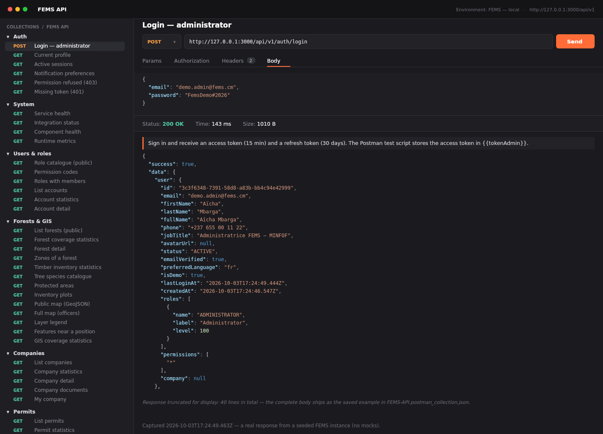

| Request | Method & route | Status | Time | Screenshot |
|---|---|---:|---:|---|
| Login — administrator | `POST /auth/login` | 200 | 143 ms | [view](./screenshots/auth-login-admin.png) |
| Current profile | `GET /auth/me` | 200 | 16 ms | [view](./screenshots/auth-me.png) |
| Active sessions | `GET /auth/sessions` | 200 | 14 ms | [view](./screenshots/auth-sessions.png) |
| Notification preferences | `GET /auth/notification-preferences` | 200 | 17 ms | [view](./screenshots/auth-notification-preferences.png) |
| Permission refused (403) | `GET /users` | 403 | 7 ms | [view](./screenshots/auth-permission-denied.png) |
| Missing token (401) | `GET /permits` | 401 | 3 ms | [view](./screenshots/auth-unauthenticated.png) |

### System

Health, integration status and runtime metrics. These are the endpoints behind **Settings → System monitoring**.

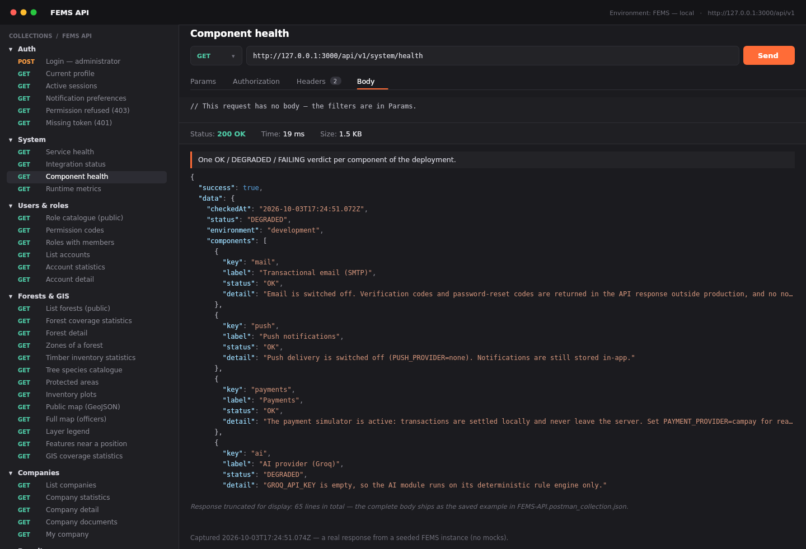

| Request | Method & route | Status | Time | Screenshot |
|---|---|---:|---:|---|
| Service health | `GET /health` | 200 | 4 ms | [view](./screenshots/health.png) |
| Integration status | `GET /system/integrations` | 200 | 9 ms | [view](./screenshots/system-integrations.png) |
| Component health | `GET /system/health` | 200 | 19 ms | [view](./screenshots/system-health.png) |
| Runtime metrics | `GET /system/metrics` | 200 | 11 ms | [view](./screenshots/system-metrics.png) |

### Users & roles

Accounts, roles and the permission catalogue. Seven roles ship with FEMS; `GET /roles/permissions` is the vocabulary the guards speak.

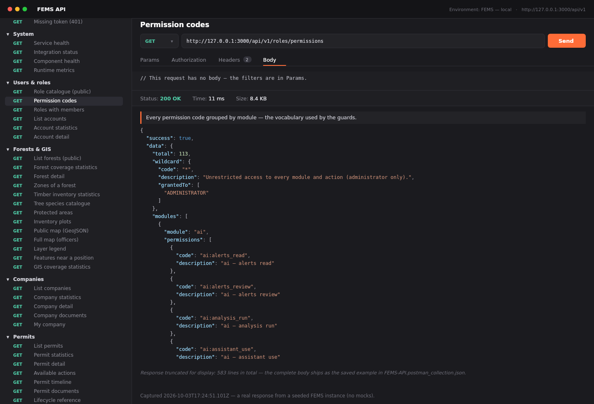

| Request | Method & route | Status | Time | Screenshot |
|---|---|---:|---:|---|
| Role catalogue (public) | `GET /roles/catalogue` | 200 | 2 ms | [view](./screenshots/roles-catalogue.png) |
| Permission codes | `GET /roles/permissions` | 200 | 11 ms | [view](./screenshots/roles-permissions.png) |
| Roles with members | `GET /roles` | 200 | 16 ms | [view](./screenshots/roles-list.png) |
| List accounts | `GET /users?page=1&limit=5` | 200 | 13 ms | [view](./screenshots/users-list.png) |
| Account statistics | `GET /users/statistics` | 200 | 16 ms | [view](./screenshots/users-statistics.png) |
| Account detail | `GET /users/e3627807-1ec0-5af9-b090-a66eb4f7a14b` | 200 | 22 ms | [view](./screenshots/users-detail.png) |

### Forests & GIS

The forest estate: forests, zones, species, protected areas, inventory plots and the map layers. Most of it is public — no token required.

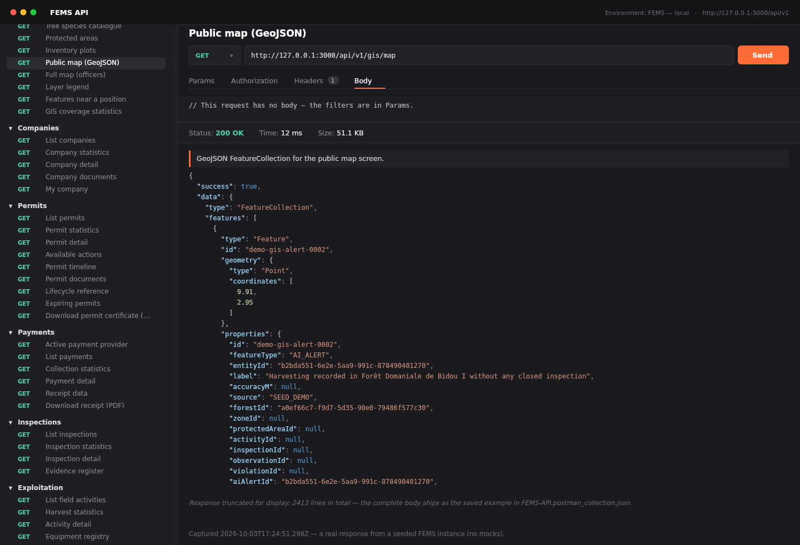

| Request | Method & route | Status | Time | Screenshot |
|---|---|---:|---:|---|
| List forests (public) | `GET /forests?page=1&limit=5` | 200 | 10 ms | [view](./screenshots/forests-list.png) |
| Forest coverage statistics | `GET /forests/statistics` | 200 | 11 ms | [view](./screenshots/forests-statistics.png) |
| Forest detail | `GET /forests/41c60e0d-7355-5dba-9755-7ebe7717c6c0` | 200 | 35 ms | [view](./screenshots/forests-detail.png) |
| Zones of a forest | `GET /forests/41c60e0d-7355-5dba-9755-7ebe7717c6c0/zones` | 200 | 9 ms | [view](./screenshots/forests-zones.png) |
| Timber inventory statistics | `GET /forests/inventory/statistics?forestId=41c60e0d-7355-5dba-9755-7ebe7717c6c0` | 200 | 16 ms | [view](./screenshots/forests-inventory-statistics.png) |
| Tree species catalogue | `GET /tree-species?page=1&limit=5` | 200 | 7 ms | [view](./screenshots/tree-species-list.png) |
| Protected areas | `GET /protected-areas?page=1&limit=5` | 200 | 5 ms | [view](./screenshots/protected-areas-list.png) |
| Inventory plots | `GET /inventory?page=1&limit=5` | 200 | 12 ms | [view](./screenshots/inventory-list.png) |
| Public map (GeoJSON) | `GET /gis/map` | 200 | 12 ms | [view](./screenshots/gis-map.png) |
| Full map (officers) | `GET /gis/map/full` | 200 | 23 ms | [view](./screenshots/gis-map-full.png) |
| Layer legend | `GET /gis/layers` | 200 | 13 ms | [view](./screenshots/gis-layers.png) |
| Features near a position | `GET /gis/nearby?latitude=3.848&longitude=11.5021&radiusKm=50` | 200 | 13 ms | [view](./screenshots/gis-nearby.png) |
| GIS coverage statistics | `GET /gis/statistics` | 200 | 21 ms | [view](./screenshots/gis-statistics.png) |

### Companies

The company register and its compliance documents. A representative only ever sees their own company.

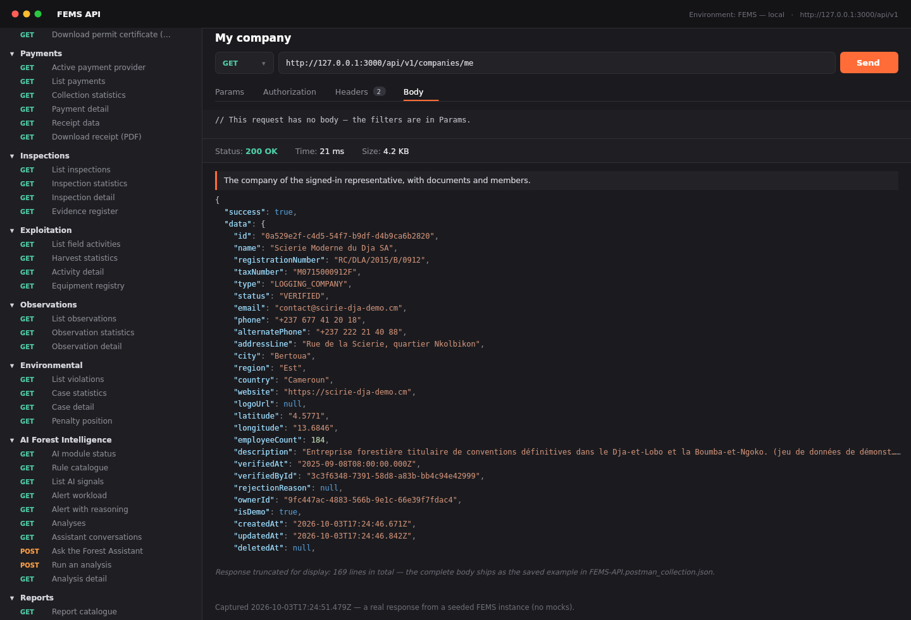

| Request | Method & route | Status | Time | Screenshot |
|---|---|---:|---:|---|
| List companies | `GET /companies?page=1&limit=5` | 200 | 17 ms | [view](./screenshots/companies-list.png) |
| Company statistics | `GET /companies/statistics` | 200 | 14 ms | [view](./screenshots/companies-statistics.png) |
| Company detail | `GET /companies/d7b68655-50ce-5981-9ca2-9f88591411f3` | 200 | 25 ms | [view](./screenshots/companies-detail.png) |
| Company documents | `GET /companies/d7b68655-50ce-5981-9ca2-9f88591411f3/documents` | 200 | 27 ms | [view](./screenshots/companies-documents.png) |
| My company | `GET /companies/me` | 200 | 21 ms | [view](./screenshots/companies-me.png) |

### Permits

The permit register and its state machine. `GET /permits/{id}/actions` tells you what *you* may do to *this* permit.

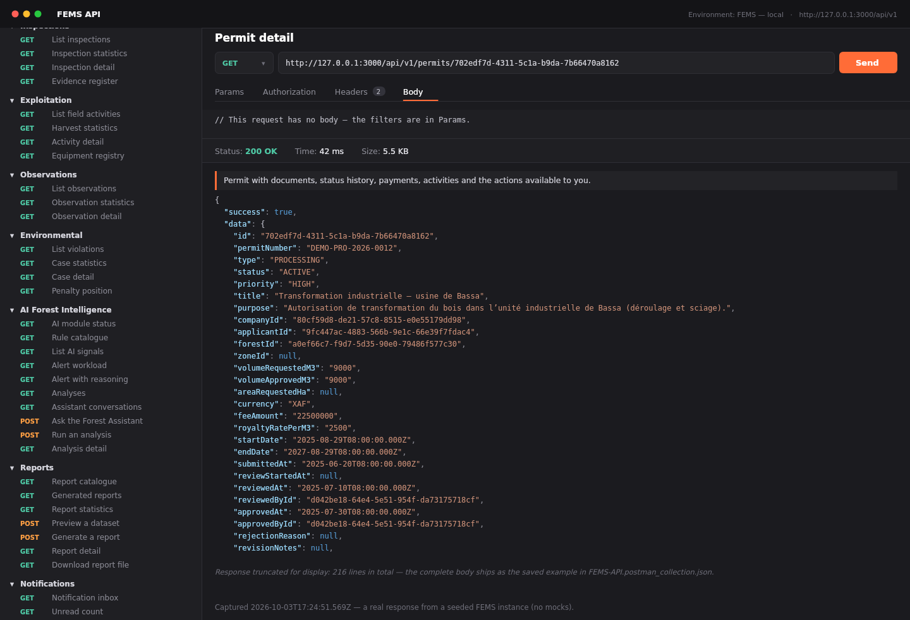

| Request | Method & route | Status | Time | Screenshot |
|---|---|---:|---:|---|
| List permits | `GET /permits?page=1&limit=5` | 200 | 19 ms | [view](./screenshots/permits-list.png) |
| Permit statistics | `GET /permits/statistics` | 200 | 24 ms | [view](./screenshots/permits-statistics.png) |
| Permit detail | `GET /permits/702edf7d-4311-5c1a-b9da-7b66470a8162` | 200 | 42 ms | [view](./screenshots/permits-detail.png) |
| Available actions | `GET /permits/702edf7d-4311-5c1a-b9da-7b66470a8162/actions` | 200 | 20 ms | [view](./screenshots/permits-actions.png) |
| Permit timeline | `GET /permits/702edf7d-4311-5c1a-b9da-7b66470a8162/timeline` | 200 | 17 ms | [view](./screenshots/permits-timeline.png) |
| Permit documents | `GET /permits/702edf7d-4311-5c1a-b9da-7b66470a8162/documents` | 200 | 20 ms | [view](./screenshots/permits-documents.png) |
| Lifecycle reference | `GET /permits/lifecycle` | 200 | 14 ms | [view](./screenshots/permits-lifecycle.png) |
| Expiring permits | `GET /permits/expiring?days=60` | 200 | 13 ms | [view](./screenshots/permits-expiring.png) |
| Download permit certificate (PDF) | `GET /permits/702edf7d-4311-5c1a-b9da-7b66470a8162/download` | 200 | 79 ms | [view](./screenshots/permits-download.png) |

### Payments

Fees, royalties and penalties, plus the printable receipt. With `PAYMENT_PROVIDER=simulator` no money moves and the receipt says so.

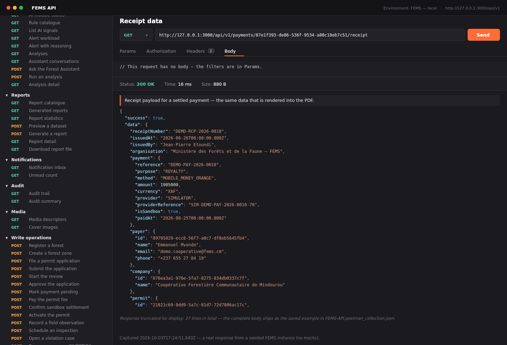

| Request | Method & route | Status | Time | Screenshot |
|---|---|---:|---:|---|
| Active payment provider | `GET /payments/provider` | 200 | 10 ms | [view](./screenshots/payments-provider.png) |
| List payments | `GET /payments?page=1&limit=5` | 200 | 26 ms | [view](./screenshots/payments-list.png) |
| Collection statistics | `GET /payments/statistics` | 200 | 14 ms | [view](./screenshots/payments-statistics.png) |
| Payment detail | `GET /payments/5920d244-4578-5648-a2f5-82396b4803e3` | 200 | 16 ms | [view](./screenshots/payments-detail.png) |
| Receipt data | `GET /payments/87e1f393-de06-536f-9534-a80c18eb7c51/receipt` | 200 | 16 ms | [view](./screenshots/payments-receipt.png) |
| Download receipt (PDF) | `GET /payments/87e1f393-de06-536f-9534-a80c18eb7c51/receipt/pdf` | 200 | 35 ms | [view](./screenshots/payments-receipt-pdf.png) |

### Inspections

Field inspections: assignment, checklist, evidence and the start → submit → review → close chain.

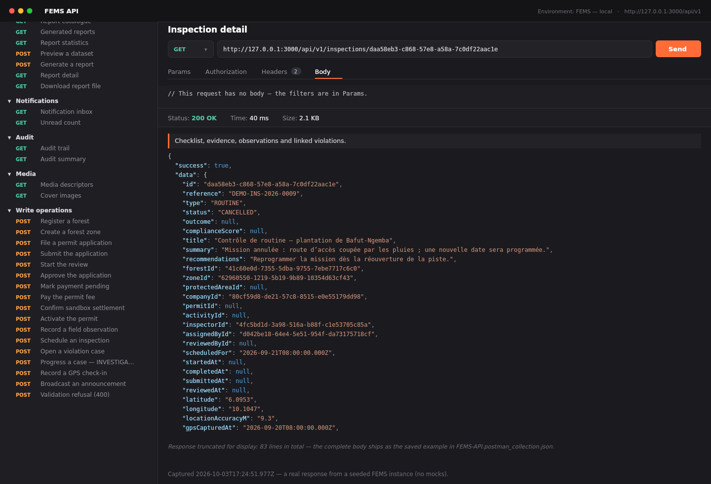

| Request | Method & route | Status | Time | Screenshot |
|---|---|---:|---:|---|
| List inspections | `GET /inspections?page=1&limit=5` | 200 | 23 ms | [view](./screenshots/inspections-list.png) |
| Inspection statistics | `GET /inspections/statistics` | 200 | 33 ms | [view](./screenshots/inspections-statistics.png) |
| Inspection detail | `GET /inspections/daa58eb3-c868-57e8-a58a-7c0df22aac1e` | 200 | 40 ms | [view](./screenshots/inspections-detail.png) |
| Evidence register | `GET /inspections/evidence?page=1&limit=5` | 200 | 18 ms | [view](./screenshots/inspections-evidence.png) |

### Exploitation

Harvesting, transport and planting activities, and the equipment used to carry them out.

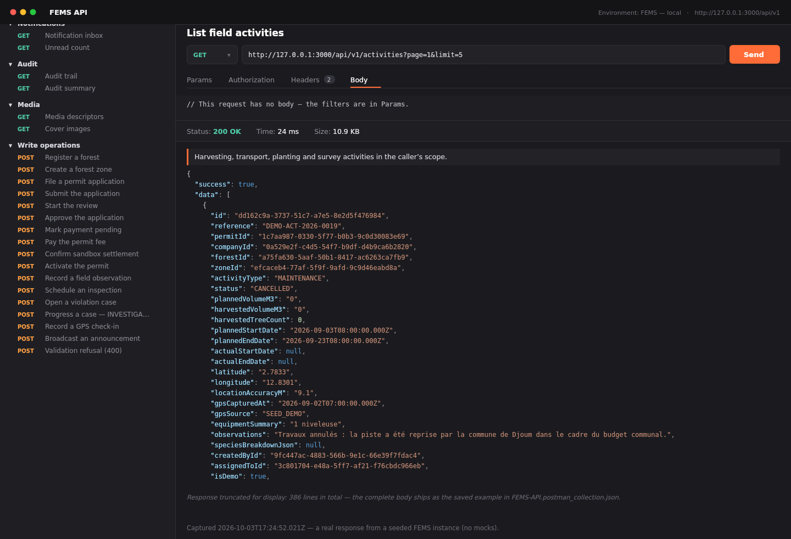

| Request | Method & route | Status | Time | Screenshot |
|---|---|---:|---:|---|
| List field activities | `GET /activities?page=1&limit=5` | 200 | 24 ms | [view](./screenshots/activities-list.png) |
| Harvest statistics | `GET /activities/statistics` | 200 | 30 ms | [view](./screenshots/activities-statistics.png) |
| Activity detail | `GET /activities/dd162c9a-3737-51c7-a7e5-8e2d5f476984` | 200 | 20 ms | [view](./screenshots/activities-detail.png) |
| Equipment registry | `GET /equipment?page=1&limit=5` | 200 | 15 ms | [view](./screenshots/equipment-list.png) |

### Observations

Field observations: the quickest thing an operator records on site, online or offline.

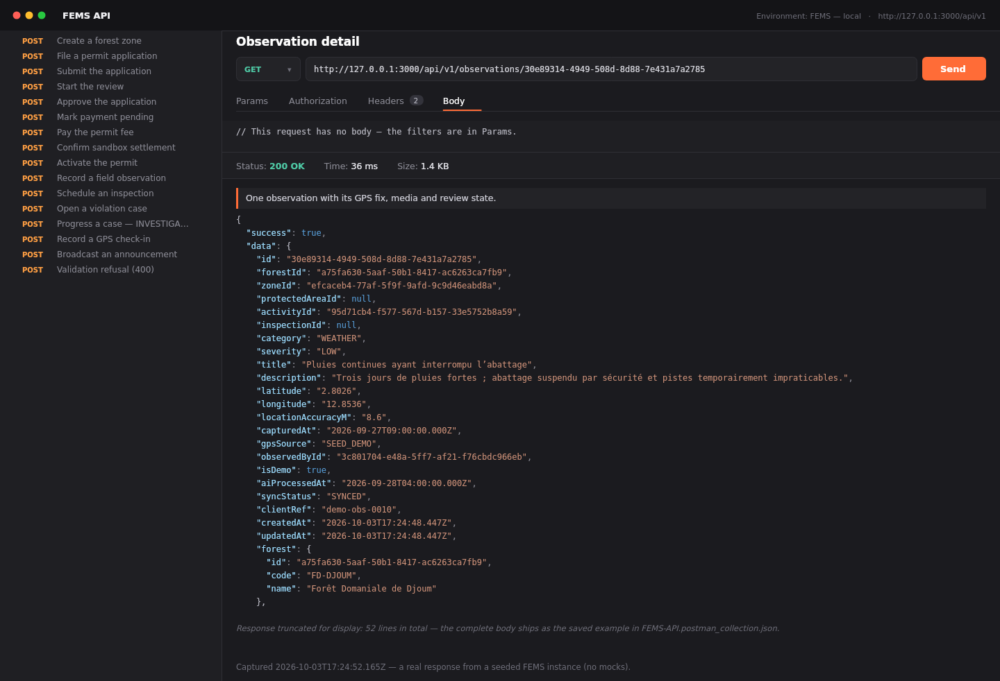

| Request | Method & route | Status | Time | Screenshot |
|---|---|---:|---:|---|
| List observations | `GET /observations?page=1&limit=5` | 200 | 23 ms | [view](./screenshots/observations-list.png) |
| Observation statistics | `GET /observations/statistics` | 200 | 14 ms | [view](./screenshots/observations-statistics.png) |
| Observation detail | `GET /observations/30e89314-4949-508d-8d88-7e431a7a2785` | 200 | 36 ms | [view](./screenshots/observations-detail.png) |

### Environmental

Violation cases, from the recorded evidence through investigation to the penalty actually settled.

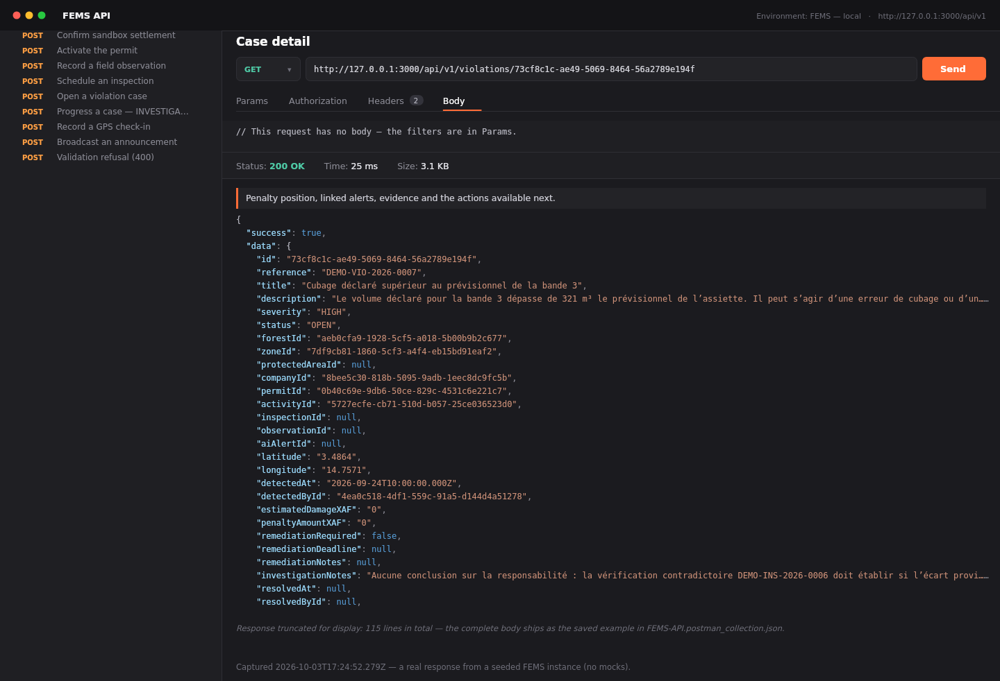

| Request | Method & route | Status | Time | Screenshot |
|---|---|---:|---:|---|
| List violations | `GET /violations?page=1&limit=5` | 200 | 50 ms | [view](./screenshots/violations-list.png) |
| Case statistics | `GET /violations/statistics` | 200 | 34 ms | [view](./screenshots/violations-statistics.png) |
| Case detail | `GET /violations/73cf8c1c-ae49-5069-8464-56a2789e194f` | 200 | 25 ms | [view](./screenshots/violations-detail.png) |
| Penalty position | `GET /violations/73cf8c1c-ae49-5069-8464-56a2789e194f/penalty` | 200 | 23 ms | [view](./screenshots/violations-penalty.png) |

### AI Forest Intelligence

The detection engine, the alerts it raises and the Forest Assistant. Every alert carries the reasoning behind it and waits for a human decision.

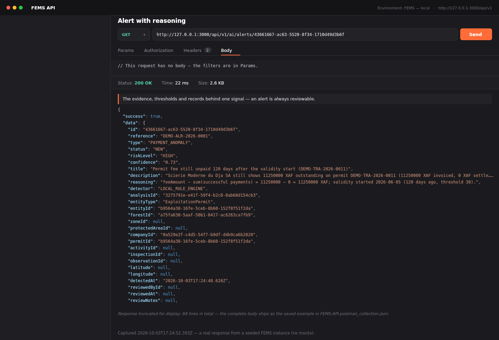

| Request | Method & route | Status | Time | Screenshot |
|---|---|---:|---:|---|
| AI module status | `GET /ai/status` | 200 | 14 ms | [view](./screenshots/ai-status.png) |
| Rule catalogue | `GET /ai/catalogue` | 200 | 8 ms | [view](./screenshots/ai-catalogue.png) |
| List AI signals | `GET /ai/alerts?page=1&limit=5` | 200 | 22 ms | [view](./screenshots/ai-alerts-list.png) |
| Alert workload | `GET /ai/alerts/statistics` | 200 | 19 ms | [view](./screenshots/ai-alerts-statistics.png) |
| Alert with reasoning | `GET /ai/alerts/43661667-ac63-5520-8f34-1710d49d3b6f` | 200 | 22 ms | [view](./screenshots/ai-alerts-detail.png) |
| Analyses | `GET /ai/analyses?page=1&limit=5` | 200 | 19 ms | [view](./screenshots/ai-analyses-list.png) |
| Assistant conversations | `GET /ai/assistant/conversations` | 200 | 11 ms | [view](./screenshots/ai-assistant-conversations.png) |
| Ask the Forest Assistant | `POST /ai/assistant/ask` | 201 | 52 ms | [view](./screenshots/ai-assistant-ask.png) |
| Run an analysis | `POST /ai/analyses` | 201 | 52 ms | [view](./screenshots/ai-analyses-run.png) |
| Analysis detail | `GET /ai/analyses/8f8a5f3d-3071-4924-8d45-9911ff5f2226` | 200 | 17 ms | [view](./screenshots/ai-analyses-detail.png) |

### Reports

The report catalogue, dataset preview and file generation (JSON / CSV / PDF).

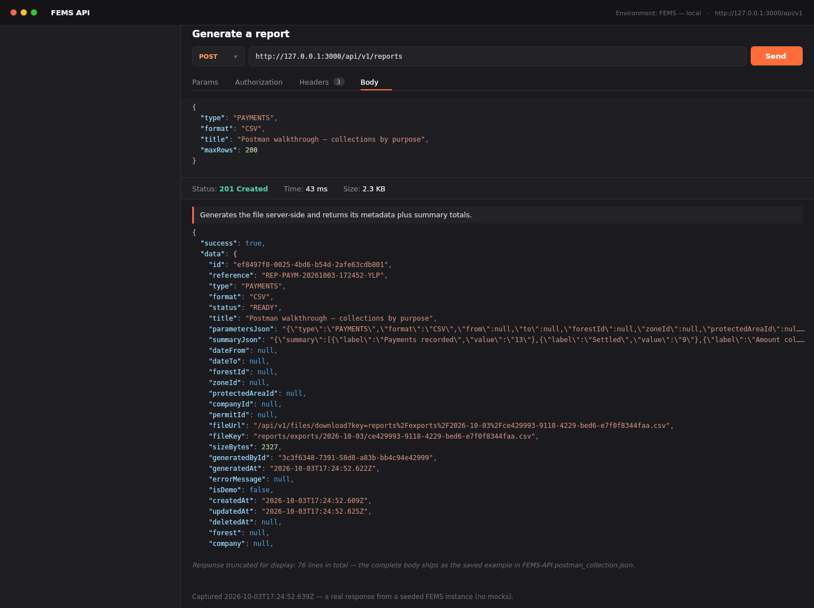

| Request | Method & route | Status | Time | Screenshot |
|---|---|---:|---:|---|
| Report catalogue | `GET /reports/catalogue` | 200 | 9 ms | [view](./screenshots/reports-catalogue.png) |
| Generated reports | `GET /reports?page=1&limit=5` | 200 | 14 ms | [view](./screenshots/reports-list.png) |
| Report statistics | `GET /reports/statistics` | 200 | 10 ms | [view](./screenshots/reports-statistics.png) |
| Preview a dataset | `POST /reports/preview` | 201 | 12 ms | [view](./screenshots/reports-preview.png) |
| Generate a report | `POST /reports` | 201 | 43 ms | [view](./screenshots/reports-generate.png) |
| Report detail | `GET /reports/ef8497f0-0025-4bd6-b54d-2afe63cdb801` | 200 | 11 ms | [view](./screenshots/reports-detail.png) |
| Download report file | `GET /reports/ef8497f0-0025-4bd6-b54d-2afe63cdb801/download` | 200 | 17 ms | [view](./screenshots/reports-download.png) |

### Notifications

The notification inbox and the badge counter.

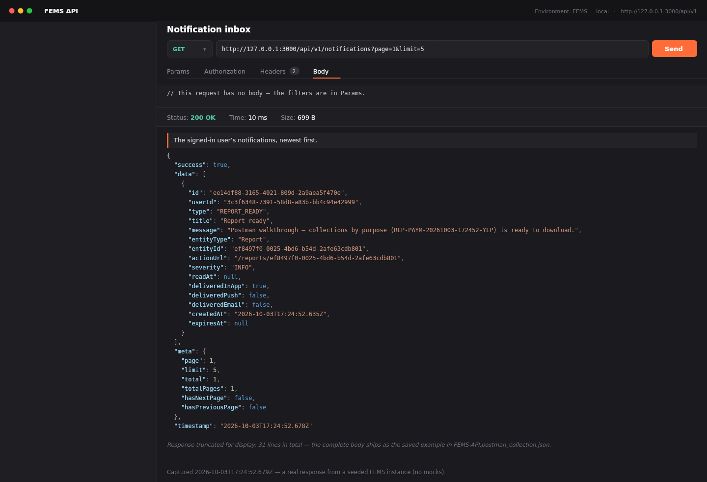

| Request | Method & route | Status | Time | Screenshot |
|---|---|---:|---:|---|
| Notification inbox | `GET /notifications?page=1&limit=5` | 200 | 10 ms | [view](./screenshots/notifications-list.png) |
| Unread count | `GET /notifications/unread-count` | 200 | 6 ms | [view](./screenshots/notifications-unread-count.png) |

### Audit

The audit trail: who did what, to which record, from where.

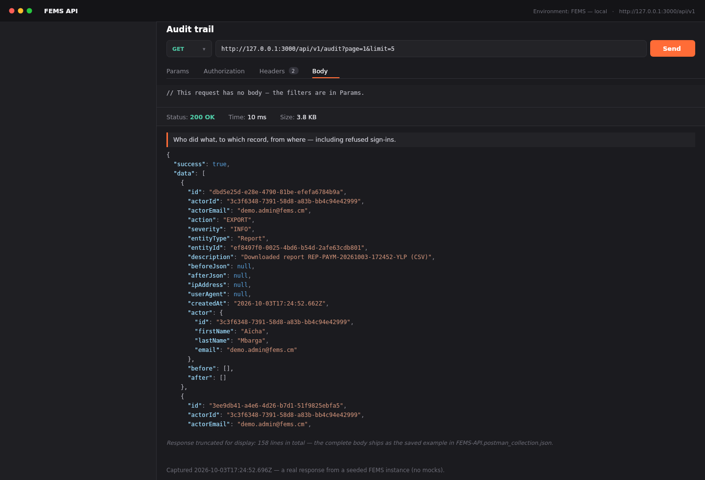

| Request | Method & route | Status | Time | Screenshot |
|---|---|---:|---:|---|
| Audit trail | `GET /audit?page=1&limit=5` | 200 | 10 ms | [view](./screenshots/audit-list.png) |
| Audit summary | `GET /audit/summary` | 200 | 12 ms | [view](./screenshots/audit-summary.png) |

### Media

Public media descriptors used for forest and species imagery.

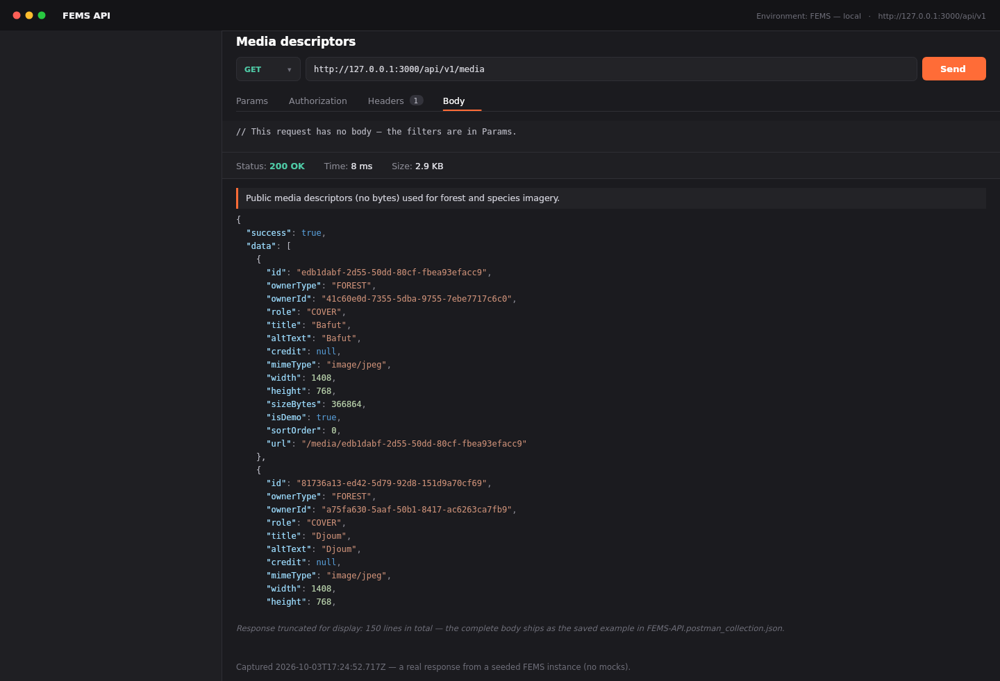

| Request | Method & route | Status | Time | Screenshot |
|---|---|---:|---:|---|
| Media descriptors | `GET /media` | 200 | 8 ms | [view](./screenshots/media-list.png) |
| Cover images | `GET /media/covers` | 200 | 2 ms | [view](./screenshots/media-covers.png) |

### Write operations

One permit, end to end: register a forest, create a zone, file an application, review it, pay the fee, activate it, then inspect it and open a case. This is the most useful folder to read first.

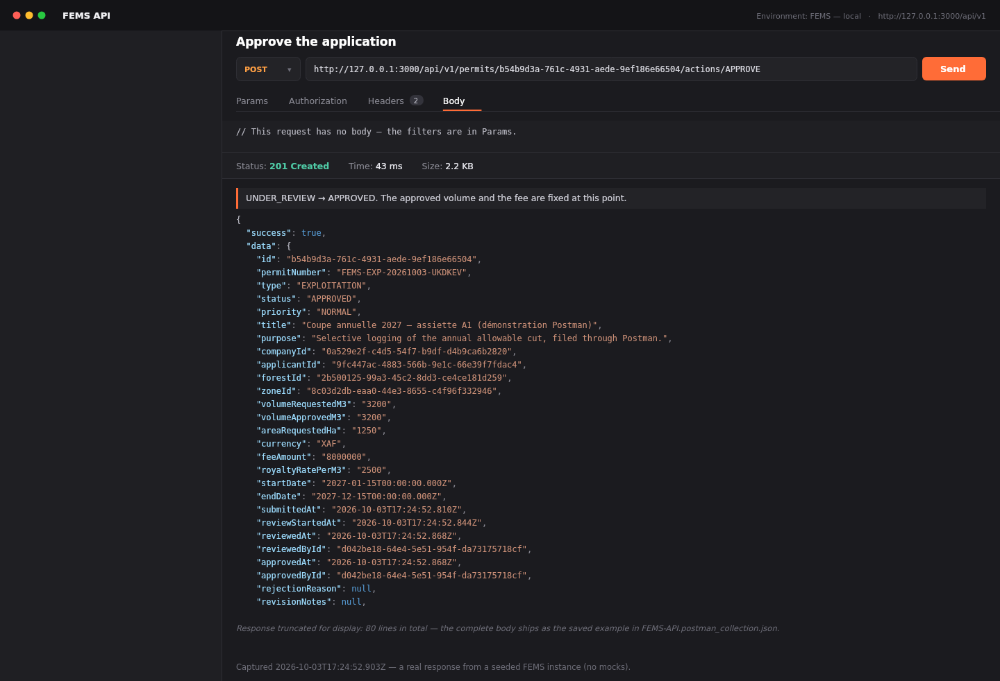

| Request | Method & route | Status | Time | Screenshot |
|---|---|---:|---:|---|
| Register a forest | `POST /forests` | 201 | 25 ms | [view](./screenshots/forests-create.png) |
| Create a forest zone | `POST /forests/2b500125-99a3-45c2-8dd3-ce4ce181d259/zones` | 201 | 22 ms | [view](./screenshots/forests-create-zone.png) |
| File a permit application | `POST /permits` | 201 | 33 ms | [view](./screenshots/permits-create.png) |
| Submit the application | `POST /permits/b54b9d3a-761c-4931-aede-9ef186e66504/actions/SUBMIT` | 201 | 34 ms | [view](./screenshots/permits-submit.png) |
| Start the review | `POST /permits/b54b9d3a-761c-4931-aede-9ef186e66504/actions/START_REVIEW` | 201 | 22 ms | [view](./screenshots/permits-start-review.png) |
| Approve the application | `POST /permits/b54b9d3a-761c-4931-aede-9ef186e66504/actions/APPROVE` | 201 | 43 ms | [view](./screenshots/permits-approve.png) |
| Mark payment pending | `POST /permits/b54b9d3a-761c-4931-aede-9ef186e66504/actions/MARK_PAYMENT_PENDING` | 201 | 24 ms | [view](./screenshots/permits-mark-payment-pending.png) |
| Pay the permit fee | `POST /payments` | 201 | 50 ms | [view](./screenshots/payments-create.png) |
| Confirm sandbox settlement | `POST /payments/4bfbab3d-0db1-44cf-9628-93c11bec52c3/simulate` | 201 | 54 ms | [view](./screenshots/payments-simulate.png) |
| Activate the permit | `POST /permits/b54b9d3a-761c-4931-aede-9ef186e66504/actions/ACTIVATE` | 201 | 36 ms | [view](./screenshots/permits-activate.png) |
| Record a field observation | `POST /observations` | 201 | 46 ms | [view](./screenshots/observations-create.png) |
| Schedule an inspection | `POST /inspections` | 201 | 40 ms | [view](./screenshots/inspections-create.png) |
| Open a violation case | `POST /violations` | 201 | 33 ms | [view](./screenshots/violations-create.png) |
| Progress a case — INVESTIGATE | `POST /violations/a42975fa-b40f-41ce-8529-3466c0bc684e/actions/INVESTIGATE` | 201 | 35 ms | [view](./screenshots/violations-action-investigate.png) |
| Record a GPS check-in | `POST /gis/positions` | 201 | 16 ms | [view](./screenshots/gis-record-position.png) |
| Broadcast an announcement | `POST /notifications/broadcast` | 201 | 15 ms | [view](./screenshots/notifications-broadcast.png) |
| Validation refusal (400) | `POST /observations` | 400 | 11 ms | [view](./screenshots/validation-error.png) |

---

## 4. Reproducing them

Everything here is regenerated from a running API. From the repository root:

```bash
# 1. start MySQL and the API, and seed the demonstration data
cd fems-backend
npm run dev:setup          # .env + dependencies + MySQL + migrations
npm run db:seed           # demonstration accounts and records
npm run start             # API on http://localhost:3000/api/v1

# 2. in another terminal, from the repository root
node docs/postman/tools/capture.mjs            # walks the API, writes tools/captured.json
node docs/postman/tools/build-collection.mjs   # writes the collection + environment

# 3. optional: re-render the screenshots (needs @napi-rs/canvas)
npm install @napi-rs/canvas
node docs/postman/tools/render-screenshots.mjs
```

`capture.mjs` expects a **freshly seeded database** (`npm run db:seed` on an empty schema): the write operations use fixed codes such as `UFA-POSTMAN-001` and will answer `409` if they already exist. Raise `THROTTLE_AUTH_LIMIT` in `fems-backend/.env` if the seven sign-ins trip the authentication rate limit.

| File | Role |
|---|---|
| `tools/capture.mjs` | Signs in with the seven demonstration accounts and walks the API in a sensible order, capturing ids as it goes. Writes `tools/captured.json`. |
| `tools/build-collection.mjs` | Merges `openapi.json` (every route) with `captured.json` (real examples) into the Postman files. |
| `tools/render-screenshots.mjs` | Draws the Postman-style PNGs and the gallery. |
| `tools/openapi.json` | `GET /api/v1/docs-json`, saved so the build works without a running API. |
| `tools/captured.json` | The raw capture: every request body, status, latency and response. |

---

## 5. Errors you will meet, and what they mean

| Status | Code | What happened |
|---|---|---|
| 401 | `AUTH_TOKEN_INVALID` | No bearer token, or it expired. Re-run a login request. |
| 403 | `PERMISSION_FORBIDDEN` | Signed in, but your role lacks the permission. The error names the missing codes. |
| 400 | `BAD_REQUEST` | Validation failed; `error.details` lists every offending field. |
| 400 | `PERMIT_INVALID_TRANSITION` | The lifecycle action is not allowed from the permit’s current status. |
| 404 | `*_NOT_FOUND` | The id does not exist **or is outside your scope** — scope and existence are deliberately indistinguishable. |
| 409 | `*_CODE_EXISTS` / `RECEIPT_UNAVAILABLE` | Duplicate code, or a receipt requested for an unsettled payment. |
| 429 | `TOO_MANY_REQUESTS` | Rate limit (120/min, 10/min on auth routes). Wait a minute and retry. |
